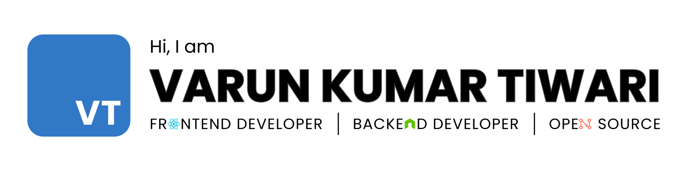

<h1 align="center">Hi 👋, I'm Varun Kumar Tiwari</h1>
<h3 align="center">A Web-Development enthusiast from India</h3>

---

## About me 👦

- 🔭 I’m currently learning more about web-bundlers.
- 🌱 I'm looking for open-source/internship opportunities.
- ✨ Find all my projects at [varuntiwari.xyz](https://varuntiwari.xyz/)
- 📫 How to reach me tiwarivarun819.vt33.vt@gmail.com

## Some achievements 🏆

- [Winner of OpenCode'21, one of the biggest open-source events, organized by GeekHaven, IIITA.](https://www.linkedin.com/posts/geekhaven-iiita_opencode21-witnessed-extensive-participation-activity-6866010351947825152-KiNB)
- [Finished in the Top 10 in Out of Context, an event organized by Effervescence, IIITA.](https://www.linkedin.com/posts/varun-tiwari-454591178_top10-outofcontext-design-activity-6882312778040930304-Fshh)
- [GSSOC'22 Project Admin, with my project Tomper Wear E-commerce.](https://www.linkedin.com/posts/varun-tiwari-454591178_gssoc22-girlscript-educationfirst-activity-6903552524234686464-bEEL)

## Blogs written ✍️

- [git set go 🐱‍👤](https://medium.com/tech-iiitg/git-set-go-950bfb8fdf19) (Published at [tech@iiitm-gwalior](https://medium.com/tech-iiitg) publication)
- [What I learned through OpenCode!](https://medium.com/nybles/what-i-learned-through-opencode-39622d7c7024) (Published at [Nybles](https://medium.com/nybles) publication)

---

## Skills 💪

---

<h2 align="center">📊 My Stats</h2>

&nbsp;

<h3 align="center">Connect with me:</h3>

  

