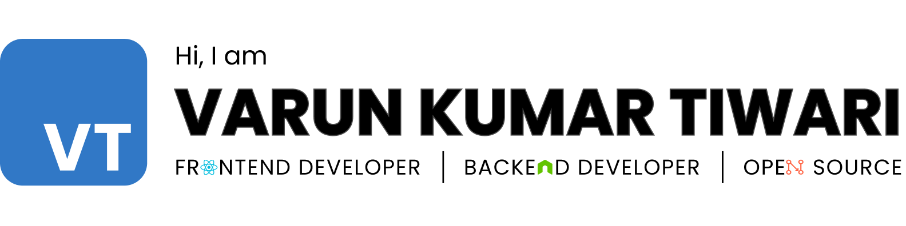

<!-- Banner -->

<!-- About me -->

## About me 👦

- 🔭 I'm currently learning Typescript.
- 🌱 I'm looking for open-source/internship opportunities.
- ✨ Find all my projects at [**varuntiwari.xyz**](https://varuntiwari.xyz/)
- 📫 How to reach me **tiwarivarun819.vt33.vt@gmail.com**

<!-- Achievements -->

## Some achievements 🏆

- [**Winner** of **OpenCode&#39;21**, one of the biggest open-source events, organized by **GeekHaven, IIITA**.](https://www.linkedin.com/posts/geekhaven-iiita_opencode21-witnessed-extensive-participation-activity-6866010351947825152-KiNB)
- [Finished in the **Top 10** in **Out of Context**, an event organized by **Effervescence, IIITA**.](https://www.linkedin.com/posts/varun-tiwari-454591178_top10-outofcontext-design-activity-6882312778040930304-Fshh)
- [**GSSOC&#39;22** Project Admin, with my project **Tomper Wear E-commerce**.](https://www.linkedin.com/posts/varun-tiwari-454591178_gssoc22-girlscript-educationfirst-activity-6903552524234686464-bEEL)
- [**TomperWear e-commerce** awarded as the **Best Web App** in **Winter Projects** organized by **GDSC and AASF, IIITM, Gwalior**.](https://www.linkedin.com/posts/aasf-iiitmg_github-winterprojects-learning-activity-6909474506340282368-GYq5)
- [The **Best Web App** category winner of the **Code With Harnoor** hackathon, organized by **Singh In USA**.](https://code-with-harnoor.devpost.com/project-gallery)

<!-- Blogs -->

## Blogs written ✍️

- [**git set go** 🐱‍👤](https://medium.com/tech-iiitg/git-set-go-950bfb8fdf19) (Published at [**tech@iiitm-gwalior**](https://medium.com/tech-iiitg) publication)
- [**What I learned through OpenCode!**](https://medium.com/nybles/what-i-learned-through-opencode-39622d7c7024) (Published at [**Nybles**](https://medium.com/nybles) publication)
- [**How to use Node JS with HTML? Guide on rendering HTML on server with Node**](https://codedamn.com/news/nodejs/use-nodejs-with-html) (Published at [**Codedamn**](https://codedamn.com/news) publication)
- [**What is Vite JS? How to use Vite JS in your projects?**](https://codedamn.com/news/javascript/what-is-vite-js) (Published at [**Codedamn**](https://codedamn.com/news) publication)
- [**How to use fetch in React? Fetch data from APIs in React.js**](https://codedamn.com/news/reactjs/how-to-use-fetch-in-react) (Published at [**Codedamn**](https://codedamn.com/news) publication)
- [**How to Remove an NPM Package: npm uninstall Guide**](https://codedamn.com/news/nodejs/remove-npm-package) (Published at [**Codedamn**](https://codedamn.com/news) publication)
- [**How to run JavaScript? Run JavaScript Files online**](https://codedamn.com/news/javascript/how-to-run-javascript-file) (Published at [**Codedamn**](https://codedamn.com/news) publication)

<!-- Contributions -->

## I 💙 Open Source

_These are some of my noteworthy contributions._

<table>
<thead>
  <tr>
    <th>Project Name</th>
    <th>Issue</th>
  </tr>
</thead>
<tbody>
  <tr>
    <td><a href="https://github.com/monkeytypegame/monkeytype" target="_blank" rel="noopener noreferrer">monkeytype</a></td>
    <td><a href="https://github.com/monkeytypegame/monkeytype/pull/3682" target="_blank" rel="noopener noreferrer">[GH-3463]: Added commands to add/remove the current theme to favorites</a></td>
  </tr>
  <tr>
    <td><a href="https://github.com/mattermost/focalboard" target="_blank" rel="noopener noreferrer">focalboard</a></td>
    <td><a href="https://github.com/mattermost/focalboard/pull/4031" target="_blank" rel="noopener noreferrer">[GH-3947]: Close confirmation dialog box on delete</a></td>
  </tr>
  <tr>
    <td><a href="https://github.com/mattermost/focalboard" target="_blank" rel="noopener noreferrer">focalboard</a></td>
    <td><a href="https://github.com/mattermost/focalboard/pull/3996" target="_blank" rel="noopener noreferrer">[GH-3947]: Added confirmation dialog when deleting a card in calendar/galley view</a></td>
  </tr>
</tbody>
</table>

<!-- Skills -->

## Skills 💪

<!-- javascript -->

<!-- typescript -->

<!-- react -->

<!-- nodejs -->

<!-- html5 -->

<!-- css3 -->

<!-- postgresql -->

<!-- expressjs -->

<!-- github -->

<!-- git -->

<!-- heroku -->

<!-- netlify -->

<!-- socketio -->

<!-- markdown -->

<!-- styledcomponents -->

<!-- mongodb -->

<!-- firebase -->

<!-- stripe -->

<!-- chakraui -->

<!-- jwt -->

<!-- bootstrap -->

<!-- figma -->

<!-- adobeillustrator -->

<!-- projects -->

## Major Projects 👷‍♂️

<table>
<thead>
  <tr>
    <th>Project Name</th>
    <th>Description</th>
    <th>Project Link</th>
  </tr>
</thead>
<tbody>
  <tr>
    <td><a href="https://github.com/varunKT001/tomper-wear-ecommerce" target="_blank" rel="noopener noreferrer">tomper-wear-ecommerce</a></td>
    <td>TomperWear is an E-commerce platform for small bussiness owners who want to expand their bussiness by providing an online purchase solution to their customers.</td>
    <td><a href="https://tomper-wear.netlify.app/" target="_blank" rel="noopener noreferrer">visit</a></td>
  </tr>
  <tr>
    <td><a href="https://github.com/varunKT001/tomper-chat" target="_blank" rel="noopener noreferrer">tomper-chat</a></td>
    <td>TomperChat is a clone of WhatsApp. Its build using MERN stack and uses socket.io for realtime messaging, online statuses, typing indicators, notifications etc.</td>
    <td><a href="https://tomper-chat.herokuapp.com/" target="_blank" rel="noopener noreferrer">visit</a></td>
  </tr>
  <tr>
    <td><a href="https://github.com/varunKT001/tomper-readmify" target="_blank" rel="noopener noreferrer">tomper-readmify</a></td>
    <td>Generate your Github Profile Readme using the best templates (UNDER DEVELOPMENT).</td>
    <td><a href="https://tomper-readmify.herokuapp.com/" target="_blank" rel="noopener noreferrer">visit</a></td>
  </tr>
  <tr>
    <td><a href="https://github.com/varunKT001/tomper-jobs" target="_blank" rel="noopener noreferrer">tomper-jobs</a></td>
    <td>TopperJobs is a job application tracking application that keeps track of the jobs you&#39;ve applied for.</td>
    <td><a href="https://tomper-jobs.netlify.app/" target="_blank" rel="noopener noreferrer">visit</a></td>
  </tr>
  <tr>
    <td><a href="https://github.com/varunKT001/tomperjs" target="_blank" rel="noopener noreferrer">tomper.js</a></td>
    <td>TomperJS is a web-framework based on MVC(Model-View-Controller) architecture pattern.</td>
    <td><a href="https://varunkt001.github.io/tomperjs/" target="_blank" rel="noopener noreferrer">visit</a></td>
  </tr>
  <tr>
    <td><a href="https://github.com/varunKT001/express-ts-decorators" target="_blank" rel="noopener noreferrer">express-ts-decorators</a></td>
    <td>Simple Typescript decorators for Express.</td>
    <td><a href="https://www.npmjs.com/package/@varuntiwari/express-ts-decorators" target="_blank" rel="noopener noreferrer">npm</a></td>
  </tr>
  <tr>
    <td><a href="https://github.com/varunKT001/tloc" target="_blank" rel="noopener noreferrer">tloc</a></td>
    <td>Find out how many lines of code you have written for your project.</td>
    <td><a href="https://www.npmjs.com/package/tloc" target="_blank" rel="noopener noreferrer">npm</a></td>
  </tr>
  <tr>
    <td colspan="3" align="center"><a href="https://github.com/varunKT001?tab=repositories">View all projects</a></td>
  </tr>
</tbody>
</table>

---

<!-- Stats -->

<h2 align="center">📊 My Stats</h2>

<!-- Contributions -->

<!-- Github stats -->

&nbsp;

<!-- Contribution graph -->

 
<strong align="center">Do you know why GraphQL is so fast?</strong>
 
Because it can&#39;t REST.

<!-- Socials -->

<h3 align="center">Connect with me:</h3>

<!-- Profile views -->

  

